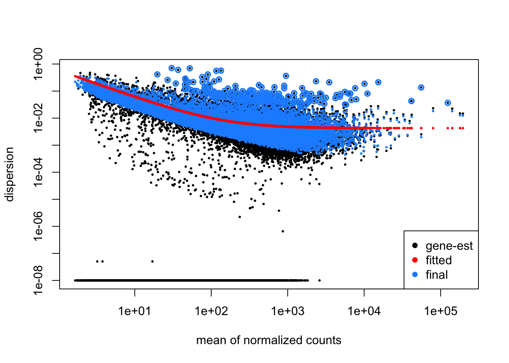

```{r, include = FALSE}
knitr::opts_chunk$set(
  collapse = TRUE,
  comment = "#>",
  message = FALSE,
  warning = FALSE,
  max.print = 100,
  cache = FALSE,
  fig.width = 7,
  fig.height = 5,
  dev="png"
)
```

This vignette shows the relevant steps to QC RNA-seq data. The rationale of this workflow is to assess whether the overall experiment meets desired quality standards and to detect low quality samples.

# Preparations
We start with loading relevant packages for the analysis.
```{r, results="hide"}
library("RNAseqQC")
library("DESeq2")
library("ensembldb")
library("dplyr")
library("ggplot2")
library("purrr")
library("tidyr")
library("tibble")
library("magrittr")
```

# Input data
The input to the workflow consists of a genes $\times$ samples count matrix and `data.frame` of metadata annotating the samples, where the number of metadata rows must equal the number of matrix columns. In addition, the count matrix must have column names and the row names must be ENSEMBL gene IDs.

As an example, we are analyzing a data set in which T47D cells with different mutation statuses were treated with E2 (estradiol) or vehicle [@bahreini2017mutation]. The input data are stored in this package as a `DESeqDataSet` called `T47D`. For demonstration purposes, we extract the count matrix and sample metadata to show how to construct an annotated `DESeqDataSet`, which is required for running this package.
```{r}
count_mat <- counts(T47D)
meta <- data.frame(colData(T47D))

# count matrix; rownames must be ENSEMBL gene IDs
count_mat[head(which(rowSums(count_mat) > 0)), 1:10]

# metadata of the samples, where row i corresponds to column i in the count matrix
meta
```

# Create DESeqDataSet
We make a `DESeqDataSet` from the input count matrix and metadata. This step also requires to specify a record identifier from the AnnotationHub package, that allows to download an `EnsDb` object to annotate gene IDs and store them in the `rowData` slot. We choose the latest *homo sapiens* AnnotationHub record.
```{r, eval=FALSE}
dds <- make_dds(counts = count_mat, metadata = meta, ah_record = "AH89426")
```

```{r, include=FALSE}
dds <- T47D
```


Records for other species can be found by running the following code. Ideally, the AnnotationHub record should match the genome build against which the sequencing reads were aligned.
```{r, eval=FALSE}
mcols(AnnotationHub::AnnotationHub()) %>%
  as_tibble(rownames = "record_id") %>%
  dplyr::filter(rdataclass == "EnsDb")
```


# QC plots on raw count matrix
## Total sample counts
A good metric to start quality control is to look at the total number of counts for each sample. This is also referred to as *library size* and we typically expect all samples to have total counts within the same order of magnitude.
```{r}
plot_total_counts(dds)
```

## Library complexity
For each sample, it is shown what fraction of counts is taken up by what fraction of genes. Samples showing a different library complexity than the rest might be considered low quality. In our case, all samples have very similar complexity.
```{r}
plot_library_complexity(dds)
```

## Gene detection
Another interesting quantity is the number of detected genes for each sample. This number depends on the detection threshold, i.e. the minimum count required to call a gene detected and also on the used protocol (e.g. RNA-seq read counts vs. DRUG-seq UMI counts). Thus, different thresholds are of interest. Note that *genes* in this context refers to ENSEMBL genes and includes protein coding genes, lncRNAs, and various other [biotypes](#biotypes).
```{r}
plot_gene_detection(dds)
```

# Gene biotypes {#biotypes}
It is also helpful to stratify the total gene count by the different gene biotypes. The plot below shows for each sample the total (library size) normalized count for the major gene biotypes. In a high quality data set, we expect this plot to show almost horizontal lines. Deviations from the horizontal pattern may correspond to different biological groups in the data set, especially in case of different cell lines, but could also indicate batch effects or low quality samples.
```{r}
plot_biotypes(dds)
```

# Gene filtering
Before continuing with quality control, a useful intermediate step is to remove genes with low counts. This often substantially reduces the total number of genes, and thus the overall size of the data set and computation time. A good strategy is to determine the size of a *biological group*, i.e. all samples under the same biological condition, and filter (keep) genes with a certain count at least as often as the size of the biological group. In our case, each group is a combination of treatment and mutation status with 4 samples and we choose 5 counts as threshold.
```{r}
dds <- filter_genes(dds, min_count = 5, min_rep = 4)
```

# Variance stabilization
For downstream tasks like clustering or PCA, a transformation is necessary so that the variance of a gene does not depend on it's mean, i.e. we want genes with low and high mean counts to have similar variances. A transformation that achieves this is called *variance stabilizing* and we use the `vst` function of DESeq2 for this task. To check if the variance is indeed stabilized, we plot for each gene the rank of the mean count versus the standard deviation. In the resulting plot, the red trend line should be relatively flat with respect to the scale on the y-axis, as can be seen for our example data.
```{r}
vsd <- vst(dds)
mean_sd_plot(vsd)
```

# Chromosomal expression

Chromosome expression plots can be useful to detect expression patterns related to the chromatin. For each chromosome, we make a heatmap where genes are arranged by chromosomal position along the x-axis and each row is a sample. The columns of the heatmap are scaled such that different genes can be compared to each other. Long red (blue) stretches along the x-axis indicate regions with increased (decreased) expression.

There can be several reasons for differential expression of a chromosomal region, for example duplication of a chromosome band or changes in chromatin accessibility. Also if the data comprise different cell lines or primary cancer samples, differential expression of a region or a whole chromosome could be observed.

In our example, chromosome 1 shows no obvious differentially expressed region, chromosome 5 shows differential expression related to the interaction of treatment and mutation status, and chromosome 14 is down regulated in samples with the D538G mutation.
```{r}
map(c("1", "5", "14"), ~plot_chromosome(vsd, .x))
```

# Replicate variability

A good quality metric on a per-sample basis is to check whether biological and/or technical replicates are closely correlated. To do this, we define groups of samples by specifying a column of the `colData` slot as grouping variable, and define all samples that belong to the same level as group. Subsequently, a reference sample is computed for each group by taking for each gene the median over all samples in the group. Finally, we make an MA-plot where each sample is plotted against its group reference.

In our example, we define a new grouping variable as the combination of treatment and mutation status and show replicate variability for the sample groups veh_WT and veh_Y537S. All shown replicates have high concordance with their respective reference. The only exception is sample *veh_Y537S_rep3*, which has an increased number down-regulated genes with high mean count.
```{r, fig.width=8, fig.height=12, out.width="95%"}
# define new grouping variable
colData(vsd)$trt_mut <- paste0(colData(vsd)$treatment, "_", colData(vsd)$mutation)

ma_plots <- plot_sample_MAs(vsd, group = "trt_mut")
cowplot::plot_grid(plotlist = ma_plots[17:24], ncol = 2)
```

# Clustering
We can also have a look at the clustering of samples by a distance metric such as euclidean distance or pearson correlation distance. It is useful to define annotation variables for the distance heatmap and relate appearing clusters to the annotation. In our example, samples cluster according to the biological groups defined in the previous section, highlighting the good quality of the data set.
```{r}
# set seed to control random annotation colors
set.seed(1)
plot_sample_clustering(vsd, anno_vars = c("treatment", "mutation", "replicate"), distance = "euclidean")
```

# PCA
The package also provides wrappers for principal component analysis (PCA) to check whether the main variation in the data is driven by biological or batch effects.
```{r}
plot_pca(vsd, PC_x = 1, PC_y = 2, color_by = "treatment", shape_by = "mutation")
```

We can also plot the expression of an individual gene, by either specifying a valid rowname or gene name
```{r}
plot_pca(vsd, PC_x = 1, PC_y = 2, color_by = "ENSG00000223972")
plot_pca(vsd, PC_x = 1, PC_y = 2, color_by = "MTOR")
```


In addition to defining the PCs to plot and variables of interest for color or shape, we can also plot the PC loadings, i.e. the genes driving a principal axis. The `plot_loadings` function offers several options to annotate loadings, e.g. by a column of the `rowData` slot, by highlighting genes of interest or the top genes of a principal axis. It is also helpful to investigate if principal axes are driven by the genes GC content, indicating a potentially sequencing related effect. 
```{r}
pca_res <- plot_pca(vsd, show_plot = FALSE)
plot_loadings(pca_res, PC = 1, annotate_top_n = 5)
plot_loadings(pca_res, PC = 1, highlight_genes = c("CD34", "FLT1", "MAPT"))
plot_loadings(pca_res, PC = 4, color_by = "gene_biotype", show_plot = F)$plot +
  theme(legend.position = "bottom")
plot_loadings(pca_res, PC = 2, color_by = "gc_content")
```

To investigate multiple PCs simultaneously, we can also make a matrix of scatter plots, to plot all pairs of principal components against each other.
```{r, fig.width=10, fig.height=9.5, out.width="95%"}
plot_pca_scatters(vsd, n_PCs = 5, color_by = "treatment", shape_by = "mutation")
```

# Differential expression

Differential expression analysis is one of the most common tasks for investigating RNA-seq data and can be also used for quality assessment. Before doing differential testing, we start by actually plotting the expression pattern of interesting genes.

## Plot a gene
Sometimes one has prior knowledge of which genes should be differentially expressed in a certain condition or one wants to get a better understanding of the genes driving a principal component. For such cases, this package offers methods to plot a gene of interest. In order to make counts between different samples comparable, sample-specific normalization factors need be computed prior to plotting. This is either done automatically when the `DESeq` function has already been run on the `DESeqDataSet` object, or alternatively directly via `estimateSizeFacors`.

```{r}
dds <- estimateSizeFactors(dds)
plot_gene("CLEC2B", dds, x_var = "mutation", color_by = "treatment")
# modify the plot
plot_gene("CLEC2B", dds, x_var = "mutation", color_by = "treatment", show_plot = F)$plot + scale_color_manual(values=c("orange","blue3"))
# a custom plot type
plot_data <- plot_gene("CLEC2B", dds, show_plot = F)$data
plot_data %>%
  ggplot(aes(treatment, count, color = mutation)) +
  geom_point() +
  geom_path(
    aes(x = treatment, y = mean_count, color = mutation, group = mutation),
    data = plot_data %>%
      group_by(treatment, mutation) %>%
      summarize(mean_count = mean(count), .groups = "drop")
  ) +
  labs(y = "log2(norm. count)", title="CLEC2B") +
  cowplot::theme_cowplot()
```

Sometimes it is also useful to inspect a large number of genes simultaneously to get a better understanding of the data. As example, we make a list of plots for the first 100 genes in the dataset and save them as a 4-page PDF file with 25 plots per page.
```{r, eval=FALSE}
plots <- rownames(dds)[1:100] %>% 
  map(~plot_gene(.x, dds, x_var="mutation", color_by="treatment", show_plot = FALSE)$plot)
save_plots_to_pdf(plots, file="genes.pdf", ncol=5, nrow=5)
```


## Differential testing
Differential testing allows to uncover genes that are differentially expressed for a certain comparison. We use DESeq2 for this purpose and refer the reader to the DESeq2 vignette on how to define a design formula and specify contrasts of interest. A good diagnostic plot for assessing the validity of differential testing assumptions is to plot the per-gene dispersion estimates versus the mean expression and check whether the red trend line shows an appropriate fit.
```{r, eval=FALSE}
# design variables need to be factors
# since we update the design of the dds
# object, we have to do it manually
dds$mutation <- as.factor(dds$mutation)
dds$treatment <- as.factor(dds$treatment)
design(dds) <- ~ mutation + treatment

dds <- DESeq(dds, parallel = T)
plotDispEsts(dds)
```

{#id .class width=7in height=5in}

## Plot a testing result
Differential testing results can be visualized in various ways. A good diagnostic is the MA-plot that plots the mean normalized count versus the log~2~-fold change. Ideally, the plot should look rather symmetric around the horizontal axis. In our example, there are genes with zero counts in one condition and relatively high counts in another, leading to very high log~2~-fold changes. We thus use `lfcShrink` instead of the `results` function, which would be the default way to compute differential testing results.

There are three different colors in the plot: Light-gray points correspond to genes with very low counts that are not considered for differential testing by the independent filtering step. Points in different shades of gray are not significant and simultaneously display the number of neighboring points to get a better understand where the majority of points are located. Red points indicate differentially expressed genes and we also place labels for the top 5 up- and down-regulated genes.
```{r, eval=FALSE}
# get testing results
de_res <- lfcShrink(dds, coef = "mutation_WT_vs_D538G", lfcThreshold = log2(1.5), type = "normal", parallel = TRUE)

# MA plot
plot_ma(de_res, dds, annotate_top_n = 5)
```

```{r, echo=FALSE}
plot_ma(T47D_diff_testing, dds, annotate_top_n = 5)
```

In addition, the `plot_ma` function allows to highlight genes, and they are colored by their respective category, i.e.\ excluded by independent filtering, not differentially expressed, and differentially expressed.
```{r, eval=FALSE}
plot_ma(de_res, dds, highlight_genes = c("CLEC2B", "PAGE5", "GAPDH"))
```

```{r, echo=FALSE}
plot_ma(T47D_diff_testing, dds, highlight_genes = c("CLEC2B", "PAGE5", "GAPDH"))
```

# SessionInfo
```{r}
sessionInfo()
```
